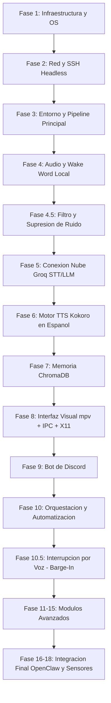

# Plan de Implementacion y Fases de Desarrollo

Este documento contiene la planificación original y detallada de todas las fases del proyecto Abril, desde la infraestructura física hasta los módulos más avanzados.

## Estado General del Proyecto
- **Fase 1 a 3 (Entorno y OS):** Completado.
- **Fase 4 a 6 (Audio, LLM, TTS):** Completado.
- **Fase 7 (Memoria ChromaDB):** Completado (100% - Persistente con tiempo relativo y filtro anti-loro).
- **Fase 8 (Avatar Visual IPC):** Completado temporalmente en consola (70% - Chica Anime ASCII a 10 FPS fluida sobre IPC).
- **Fase 9 (Bot Discord):** Completado (100% - Conexión por MD y Servidores).
- **Fase 10 (Orquestación continua):** Pendiente.

## Detalle de Fases y Tareas

### Fase 1: Infraestructura Fisica y Sistema Operativo
1. **Ensamblaje**: Instalar el SSD de 125 GB y conectar la mini pantalla HDMI a la GPU GTX 960.
2. **Instalacion de OS e Interfaz Ligera**: Instalar una distribución Linux base sin escritorio pesado (como **Ubuntu Server LTS** o **Debian**), pero anadiendo un servidor de ventanas minimalista (**X11 + Openbox**). Esto consume menos de 50MB de RAM y permite ejecutar reproductores de video graficos como `mpv`.
3. **Controladores Graficos**: Instalar los drivers propietarios de NVIDIA legacy de la serie **nvidia-driver-470** o **nvidia-driver-525** (segun la distro) en la GTX 960 para asegurar decodificacion acelerada por hardware de los videos.

### Fase 2: Red y Gestion Remota (Headless)
1. **Acceso Remoto**: Instalar y configurar el servidor OpenSSH.
2. **IP Estatica**: Configurar la tarjeta de red en `/etc/netplan/` o desde el router de tu casa para asignarle una IP estatica local (ej. `192.168.1.100`).
3. **Desconexion fisica**: Desconectar teclado, raton y monitor principal. A partir de aqui, controlaras todo por SSH desde tu laptop personal.

### Fase 3: Entorno Virtual y Dependencias de Python
1. **Dependencias del Sistema**: Instalar librerias esenciales para compilar y reproducir video/audio.
2. **Configuracion de Entorno**: Crear el directorio del proyecto y configurar el entorno virtual.
3. **Creacion de Archivos Base**: Inicializar `.env`, `config.json` y `requirements.txt`.

### Fase 4: Entrada de Audio y Wake Word Local
1. **Instalacion**: Instalar PyAudio y `openWakeWord`.
2. **Configuracion ALSA**: Configurar los dispositivos de entrada de audio para asegurar que el microfono ambiental USB o Jack de 3.5mm sea el dispositivo de captura por defecto en Linux.
3. **Desarrollo de `wake_word.py`**:
   * Cargar el modelo pre-entrenado ONNX.
   * Monitorear el flujo del microfono de forma continua.
   * Implementar deteccion de silencio (VAD ligera) para pausar la escucha cuando tu dejes de hablar.
   * Retornar una senal al orquestador cuando se detecte "Abril".

### Fase 4.5: Filtro de Audio de Entrada (Reduccion de Ruido)
1. **Reduccion de Ruido**: Dado que es un microfono ambiental de habitacion (sujeto a ruido de ventiladores, eco o musica), se integrara un filtro de procesamiento digital de senales (DSP).
2. **Implementacion**: Utilizar filtros nativos de PipeWire/PulseAudio o aplicar una biblioteca liviana en Python antes de enviar el buffer de audio a la API de Whisper en Groq. Esto previene transcripciones erroneas o alucinaciones debidas al ruido ambiente.

### Fase 5: Conexion Nube (Groq STT/LLM)
1. **Script `speech_to_text.py`**:
   * Al recibir la senal de activacion, graba el comando de audio del usuario en memoria o en un archivo temporal ligero.
   * Envia el audio a la API de Groq usando Whisper-large-v3 para obtener la transcripcion exacta en espanol en milisegundos.
2. **Script `brain_llm.py`**:
   * Envia la transcripcion junto con el historial reciente de conversacion a la API de Groq usando el modelo `llama3-8b-8192` (o superior).
   * Define el System Prompt para darle a Abril su personalidad unica, sus reglas de respuesta en espanol, y formateo adecuado para ser leido de forma natural.

### Fase 6: Sintesis de Voz Local con Kokoro-82M (Espanol Nativo)
1. **Instalacion**: Instalar Kokoro ONNX Runtime y dependencias de procesamiento de voz en espanol.
2. **Configuracion de Voz**:
   * Descargar el modelo `kokoro-v0_19.onnx` (~300MB) y los archivos JSON de fonemas en espanol.
   * Configurar el pipeline en el codigo de `text_to_speech.py` especificando el idioma espanol de forma explicita.
   * Cargar una voz en espanol compatible.

### Fase 7: Memoria a Largo Plazo con ChromaDB
1. **Instalacion**: Instalar `chromadb` y `sentence-transformers`.
2. **Estructura de `memory_system.py`**:
   * Inicializar una base de datos vectorial local.
   * Generar embeddings automaticos de cada conversacion relevante.
   * Al recibir una pregunta, buscar las 3 conversaciones pasadas mas semanticamente similares para inyectarlas como contexto en el prompt enviado a Groq.

### Fase 8: Interfaz Visual (mpv e IPC en Entorno Grafico Minimalista)
1. **Configuracion del Monitor**: Asegurar que la mini pantalla este configurada y detectada bajo la sesion de X11 en la salida HDMI.
2. **Configuracion de `mpv`**:
   * Lanzar una sesion ligera de Openbox para dar soporte grafico.
   * Crear un script en Bash que inicie `mpv` en modo pantalla completa en la pantalla secundaria bajo X11, levantando un servidor IPC.
3. **Controlador Visual (`visual_controller.py`)**:
   * Script en Python que se conecte al socket IPC.
   * Enviar comandos JSON para alternar videos de forma instantanea sin parpadeo de pantalla (Idle, Thinking, Speaking).

### Fase 9: Conexion con Discord
1. **Desarrollo del Bot**: Crear un bot en `discord-bot/bot.py` usando `discord.py`.
2. **Persistencia de Canal**: Vincular el bot a tus servidores/canales designados.
3. **Puente de Comunicacion**: Enlazar los mensajes de Discord con `brain_llm.py` y `memory_system.py`.

### Fase 10: Orquestacion y Servicio en Segundo Plano (systemd)
1. **Bucle Principal (`main.py`)**: Coordina todos los scripts mediante una maquina de estados.
2. **Servicio Automatico (systemd)**: Crear un archivo para que el asistente arranque automaticamente al encender la torre de la habitacion y se reinicie en caso de algun fallo.

### Fase 10.5: Interrupcion por Voz (Barge-In)
1. **Logica de Interrupcion**: Habilitar que el usuario detenga a Abril mientras esta hablando si la respuesta es demasiado larga o incorrecta.
2. **Implementacion**: Mantener el hilo de `openWakeWord` en ejecucion y escuchando incluso en el estado `HABLANDO`.

---

## Modulos Avanzados (Interaccion de Ciencia Ficcion)

Para transformar a Abril de un asistente pasivo a uno proactivo y conectado con su entorno, se incorporaran estas funcionalidades:

### 1. Eventos Proactivos y Tareas Programadas (Fase 11)
* **Tecnologia**: `APScheduler` en Python.
* **Ejemplo**: *"Buenos dias. Recuerda que en 30 minutos inicia tu clase"*.

### 2. Control del Entorno (Fase 12 - Domotica Local)
* **Tecnologia**: `tinytuya` (para dispositivos Tuya/Smart Life).
* **Flujo**: *"Abril, apaga las luces"* -> Groq detecta la intencion -> Ejecuta la llamada local en milisegundos por Wi-Fi.

### 3. Personalizacion Dinamica del System Prompt (Fase 13)
* **Tecnologia**: Inyeccion dinamica de variables en `brain_llm.py`.
* **Ejemplo**: A partir de las 11:00 PM, el prompt le indicara a Abril: *"Es tarde en la noche. Responde con un tono suave y sugiere descanso"*.

### 4. Sistema de Alertas del Celular (Fase 14)
* **Tecnologia**: `KDE Connect` emparejado con tu dispositivo Android. Un script local lee las notificaciones entrantes y las filtra.
* **Caso de Uso**: Dejas tu celular cargando en otra habitacion o estas lejos del escritorio. Si recibes un mensaje urgente (ej. un WhatsApp de tu familia), Abril te interrumpe y dice: *"Muted, te acaba de llegar un mensaje de tu mama diciendo que ya llego"*. Te permite dictarle una respuesta en voz alta sin tocar tu telefono.

### 5. Vision Hibrida via Webcam USB (Fase 15)
Habilidad para que Abril "vea" el mundo real y pueda ayudarte en tareas manuales o visuales.
* **Tecnologia**: `OpenCV` para capturar un fotograma de una Webcam conectada a su hardware, el cual se envia comprimido a la API Vision de Groq (usando Llama 3.2 Vision u otro modelo multimodal).
* **Caso de Uso**: Le muestras a Abril una placa electronica o un cable roto en tus manos y le dices: *"Abril, mira esto, ¿donde va conectado este cable rojo?"*. Ella analiza la foto en milisegundos y te responde conversacionalmente. Tambien puede servir para que le muestres ropa y te diga si combina.

---
### 6. Integracion y Control de la PC Principal (Fase 16 - OpenClaw + MXC)
Habilidad de Abril para interactuar de manera remota con tu ordenador de uso diario y ejecutar tareas o automatizaciones complejas (abrir programas, revisar correos, organizar ventanas).
* **Tecnologia**: Framework **OpenClaw** y **Microsoft Execution Containers (MXC)**.
* **Implementacion**: Para usar las funciones de agente capaz de controlar tu PC, debes instalar OpenClaw y configurarlo exclusivamente en el PC que quieres usar para esto (NO en el hardware de Abril ni en la Raspberry Pi). Abril funcionara como el "cerebro" y enviara las instrucciones por red local a esa instancia de OpenClaw.
* **Seguridad**: Aprovechando los nuevos contenedores para agentes de Microsoft (MXC), OpenClaw correra en un entorno aislado (sandbox) en tu PC principal. Esto garantiza de manera nativa que si la IA llega a alucinar o intenta algo destructivo, el sistema operativo de Windows bloqueara la accion, protegiendo tus archivos.

### 7. Automatizacion Basada en Criterios de Presencia (Fase 17)
Dotar a la habitacion de sensores fisicos para que Abril reaccione a tu existencia sin necesidad de usar comandos de voz.
* **Tecnologia**: Integracion de sensores de presencia humana o de micromovimiento (PIR / Radar de microondas) conectados via Wi-Fi (ESP32 o Tuya).
* **Caso de Uso**: Llegas a tu cuarto despues del trabajo. El sensor detecta que entraste e instantaneamente Abril "despierta" su pantalla, enciende tus luces de ambiente led y te dice proactivamente: *"Hola Muted, bienvenido de nuevo"*. Si sales por mas de 15 minutos, ella misma apaga la iluminacion y la pantalla para mantener su bajo consumo.

### 8. Sincronizacion de Cuentas Personales (Fase 18)
Conectar el cerebro de Abril a tus ecosistemas digitales privados de productividad.
* **Tecnologia**: Autenticacion ligera OAuth2 para integracion con APIs de Google Calendar, Gmail o Microsoft To-Do.
* **Caso de Uso**: Te despiertas y preguntas: *"Abril, ¿tengo algo importante hoy?"*. Ella lee tu calendario y responde: *"Tienes la entrega del proyecto a las 2 PM, y por cierto, te acaba de llegar un correo urgente de la universidad"*.

---

## Estimacion de Tiempos de Desarrollo

| Fase | Duracion Estimada | Dificultad |
| :--- | :--- | :--- |
| **Fase 1 y 2**: Montaje fisico, OS Linux Headless e IP estatica | 1 a 2 Semanas | Media |
| **Fase 3 y 4**: Entorno Python, Audio (ALSA) y Wake Word local | 2 a 3 Semanas | Alta |
| **Fase 4.5 a 6**: APIs de Groq, Filtros DSP y TTS Kokoro | 2 Semanas | Media |
| **Fase 7 y 8**: Memoria ChromaDB e Integracion IPC con `mpv` | 3 Semanas | Alta |
| **Fase 9 y 10**: Bot de Discord, Orquestador Principal y systemd | 2 Semanas | Media |
| **Fase 11 a 15**: Domotica, Vision, Celular y Proactividad | 1 a 2 Meses | Alta |
| **Fase 16 a 18**: OpenClaw, Sensores de Presencia y Cuentas | Varios Meses | Muy Alta |
