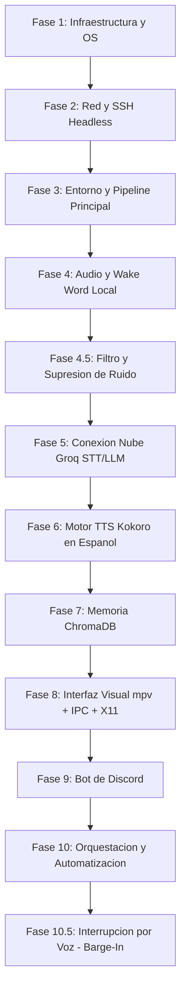

# Asistente Virtual Autonomo: Abril

Este es el repositorio del proyecto **Abril**, un asistente de voz inteligente, autonomo y de presencia fisica constante 24/7 en habitacion, disenado bajo una arquitectura hibrida local/nube para optimizar recursos en hardware limitado.

---

## Especificaciones de Hardware (Servidor Local)
*   **CPU**: Intel Core i7 de 2ª Generacion (Procesamiento local ligero).
*   **GPU**: NVIDIA GeForce GTX 960 (Decodificacion de video acelerada por hardware).
*   **RAM**: 12 GB.
*   **Almacenamiento**: SSD de 125 GB.
*   **Pantalla**: Mini pantalla dedicada de 7-10 pulgadas conectada por HDMI para el avatar.
*   **Perifericos**: Micrófono ambiental USB y parlantes por Jack de 3.5mm o USB.

---

## Fases y Plan de Implementacion



### Estructura del Proyecto
```text
abril-asistente/
├── backend/
│   ├── main.py               # Orquestador principal (Maquina de estados y Barge-In)
│   ├── wake_word.py          # Escucha activa y VAD (openWakeWord + Filtro de ruido)
│   ├── speech_to_text.py     # Cliente Groq Whisper API
│   ├── brain_llm.py          # Cliente Groq LLM (Llama 3 con prompt dinamico)
│   ├── text_to_speech.py     # Motor local Kokoro-82M (ONNX en espanol)
│   ├── memory_system.py      # Base de datos vectorial (ChromaDB)
│   ├── visual_controller.py  # Controlador de mpv via IPC
│   ├── commands.py           # Control del sistema y llamadas de utilidad
│   ├── automation.py         # Planificador de tareas proactivas (APScheduler)
│   ├── domotica.py           # Control de dispositivos inteligentes (tinytuya)
│   ├── phone_alerts.py       # Escucha de notificaciones moviles (KDE Connect)
│   ├── vision.py             # Captura de webcam y API de vision (OpenCV)
│   ├── config.py             # Configuracion centralizada (config.json)
│   └── logger.py             # Logs del sistema
├── discord-bot/
│   ├── bot.py                # Cliente de Discord
│   └── bridge.py             # Enlace de mensajes y memoria con el backend
├── assets/
│   ├── videos/
│   │   ├── idle.mp4          # Loop de respiracion/espera
│   │   ├── thinking.mp4      # Loop de procesamiento
│   │   └── speaking.mp4      # Loop de hablar (movimiento de labios)
│   └── voices/
│       └── custom_blend.json # Configuracion de mezclas para Kokoro
├── data/
│   └── chromadb/             # Base de datos de memoria local
├── config.json               # Configuracion central (APIs, puertos, nombres)
├── .env                      # API Keys (Groq, Brave Search, Discord Token)
├── requirements.txt          # Dependencias de Python
└── start_abril.sh            # Script de arranque del sistema (X11 + mpv)
```

---

## Detalle de Fases y Tareas

### Fase 1: Infraestructura Fisica y Sistema Operativo
1. **Ensamblaje**: Instalar el SSD de 125 GB y conectar la mini pantalla HDMI a la GPU GTX 960.
2. **Instalacion de OS e Interfaz Ligera**: Instalar una distribución Linux base sin escritorio pesado (como **Ubuntu Server LTS** o **Debian**), pero anadiendo un servidor de ventanas minimalista (**X11 + Openbox**). Esto consume menos de 50MB de RAM y permite ejecutar reproductores de video graficos como `mpv`.
3. **Controladores Graficos**: Instalar los drivers propietarios de NVIDIA legacy de la serie **nvidia-driver-470** o **nvidia-driver-525** (segun la distro) en la GTX 960 para asegurar decodificacion acelerada por hardware de los videos.
   ```bash
   sudo apt update
   sudo apt install nvidia-driver-470 xorg openbox
   ```

### Fase 2: Red y Gestion Remota (Headless)
1. **Acceso Remoto**: Instalar y configurar el servidor OpenSSH.
   ```bash
   sudo apt install openssh-server
   sudo systemctl enable ssh
   sudo systemctl start ssh
   ```
2. **IP Estatica**: Configurar la tarjeta de red en `/etc/netplan/` o desde el router de tu casa para asignarle una IP estatica local (ej. `192.168.1.100`).
3. **Desconexion fisica**: Desconectar teclado, raton y monitor principal. A partir de aqui, controlaras todo por SSH desde tu laptop personal:
   ```bash
   ssh usuario@192.168.1.100
   ```

### Fase 3: Entorno Virtual y Dependencias de Python
1. **Dependencias del Sistema**: Instalar librerias esenciales para compilar y reproducir video/audio.
   ```bash
   sudo apt install python3-pip python3-venv git ffmpeg mpv portaudio19-dev
   ```
2. **Configuracion de Entorno**: Crear el directorio del proyecto y configurar el entorno virtual.
   ```bash
   mkdir ~/abril-asistente && cd ~/abril-asistente
   python3 -m venv venv
   source venv/bin/activate
   ```
3. **Creacion de Archivos Base**: Inicializar `.env`, `config.json` y `requirements.txt`.

### Fase 4: Entrada de Audio y Wake Word Local
1. **Instalacion**: Instalar PyAudio y `openWakeWord`.
2. **Configuracion ALSA**: Configurar los dispositivos de entrada de audio para asegurar que el microfono ambiental USB o Jack de 3.5mm sea el dispositivo de captura por defecto en Linux.
3. **Desarrollo de `wake_word.py`**:
   * Cargar el modelo pre-entrenado ONNX.
   * Monitorear el flujo del microfono de forma continua.
   * Implementar deteccion de silencio (VAD ligera) para pausar la escucha cuando tu dejes de hablar.
   * Retornar una senal al orquestador cuando se detecte "Abril".

### Fase 4.5: Filtro de Audio de Entrada (Reduccion de Ruido)
1. **Reduccion de Ruido**: Dado que es un microfono ambiental de habitacion (sujeto a ruido de ventiladores, eco o musica), se integrara un filtro de procesamiento digital de senales (DSP).
2. **Implementacion**: Utilizar filtros nativos de PipeWire/PulseAudio (como **rnnoise** o **webrtcdsp**) o aplicar una biblioteca liviana en Python (como `noisereduce` o `webrtcvad` en modo supresor) antes de enviar el buffer de audio a la API de Whisper en Groq. Esto previene transcripciones erroneas o alucinaciones debidas al ruido ambiente.

### Fase 5: Conexion Nube (Groq STT/LLM)
1. **Script `speech_to_text.py`**:
   * Al recibir la senal de activacion, graba el comando de audio del usuario en memoria o en un archivo temporal ligero.
   * Envia el audio a la API de Groq usando Whisper-large-v3 para obtener la transcripcion exacta en espanol en milisegundos.
2. **Script `brain_llm.py`**:
   * Envia la transcripcion junto con el historial reciente de conversacion a la API de Groq usando el modelo `llama3-8b-8192` (o superior).
   * Define el System Prompt para darle a Abril su personalidad unica, sus reglas de respuesta en espanol, y formateo adecuado para ser leido de forma natural.

### Fase 6: Sintesis de Voz Local con Kokoro-82M (Espanol Nativo)
1. **Instalacion**: Instalar Kokoro ONNX Runtime y dependencias de procesamiento de voz en espanol (incluyendo `soundfile`, `g2p_en` y el backend phonemizer compatible con espanol como `espeak-ng`).
   ```bash
   pip install kokoro-onnx onnxruntime
   sudo apt install espeak-ng  # Requerido para la fonetizacion correcta en espanol
   ```
2. **Configuracion de Voz**:
   * Descargar el modelo `kokoro-v0_19.onnx` (~300MB) y los archivos JSON de fonemas en espanol (`es-es` o `es-la`).
   * Configurar el pipeline en el codigo de `text_to_speech.py` especificando el idioma espanol de forma explicita.
   * Cargar una voz en espanol compatible (ej. voces que inicien con prefijo `es_`, como `es_dalia` o `es_esperanza`). Si se usa el acento en ingles por defecto, la pronunciacion fallara por completo.

### Fase 7: Memoria a Largo Plazo con ChromaDB
1. **Instalacion**: Instalar `chromadb` y `sentence-transformers`.
2. **Estructura de `memory_system.py`**:
   * Inicializar una base de datos vectorial local.
   * Generar embeddings automaticos de cada conversacion relevante.
   * Al recibir una pregunta, buscar las 3 conversaciones pasadas mas semanticamente similares para inyectarlas como contexto en el prompt enviado a Groq.

### Fase 8: Interfaz Visual (mpv e IPC en Entorno Grafico Minimalista)
1. **Configuracion del Monitor**: Asegurar que la mini pantalla este configurada y detectada bajo la sesion de X11 en la salida HDMI.
2. **Configuracion de `mpv`**:
   * Lanzar una sesion ligera de Openbox (ej. `xinit openbox-session -- :0`) para dar soporte grafico.
   * Crear un script en Bash que inicie `mpv` en modo pantalla completa en la pantalla secundaria bajo X11, levantando un servidor IPC:
     ```bash
     DISPLAY=:0 mpv --fullscreen --screen=1 --loop-file=inf --input-ipc-server=/tmp/mpv-socket assets/videos/idle.mp4
     ```
3. **Controlador Visual (`visual_controller.py`)**:
   * Script en Python que se conecte al socket `/tmp/mpv-socket`.
   * Enviar comandos JSON para alternar videos de forma instantanea sin parpadeo de pantalla:
     * **Idle**: Loop de respiracion por defecto.
     * **Thinking**: Cuando el Wake Word se activa y el LLM esta procesando la respuesta.
     * **Speaking**: Cuando Kokoro empiece a reproducir audio, mpv reproduce el video de hablar y vuelve a *Idle* en cuanto el audio finaliza.

### Fase 9: Conexion con Discord
1. **Desarrollo del Bot**: Crear un bot en `discord-bot/bot.py` usando `discord.py`.
2. **Persistencia de Canal**: Vincular el bot a tus servidores/canales designados.
3. **Puente de Comunicacion**: Enlazar los mensajes de Discord con `brain_llm.py` y `memory_system.py` para que Abril use la misma base de recuerdos y personalidad en el chat de texto de Discord que en tu habitacion.

### Fase 10: Orquestacion y Servicio en Segundo Plano (systemd)
1. **Bucle Principal (`main.py`)**: Coordina todos los scripts mediante una maquina de estados:
   * `Estado: ESPERA` (Wake Word buscando "Abril" -> mpv en loop `idle.mp4`).
   * `Estado: ESCUCHANDO` (Graba tu voz -> mpv en loop `idle.mp4` o una animacion de atencion).
   * `Estado: PENSANDO` (Llama a Groq STT + LLM -> mpv en loop `thinking.mp4`).
   * `Estado: HABLANDO` (Envia respuesta a Kokoro y reproduce el audio -> mpv en loop `speaking.mp4`).
2. **Servicio Automatico (systemd)**:
   * Crear un archivo `/etc/systemd/system/abril.service` para que el asistente arranque automaticamente al encender la torre de la habitacion y se reinicie en caso de algun fallo.

### Fase 10.5: Interrupcion por Voz (Barge-In)
1. **Logica de Interrupcion**: Habilitar que el usuario detenga a Abril mientras esta hablando si la respuesta es demasiado larga o incorrecta.
2. **Implementacion**:
   * Mantener el hilo de `openWakeWord` en ejecucion y escuchando incluso en el estado `HABLANDO`.
   * Si el detector identifica la palabra de activacion o comandos clave como *"Abril, callate"* o *"Suficiente"*, interrumpe inmediatamente el flujo de audio de Kokoro.
   * Envia un comando JSON a `/tmp/mpv-socket` para detener la reproduccion del video de habla y reestablecer el loop de `idle.mp4`, volviendo al estado de `ESPERA` al instante.

---

## Modulos Avanzados (Interaccion de Ciencia Ficcion)

Para transformar a Abril de un asistente pasivo a uno proactivo y conectado con su entorno, se incorporaran estas 5 funcionalidades avanzadas perfectamente viables en tu hardware local:

### 1. Eventos Proactivos y Tareas Programadas (Fase 11)
*   **Que es**: Permitir que Abril inicie la interaccion sin esperar a ser llamada, basandose en la hora o eventos de internet (ej. recordatorios de Google Calendar, alertas de clima).
*   **Tecnologia**: **`APScheduler`** en Python ejecutandose en segundo plano en el orquestador. 
*   **Ejemplo**: *"Buenos dias. Recuerda que en 30 minutos inicia tu clase/reunion"* a las 8:00 AM, o avisarte proactivamente si se detecta pronostico de lluvia inminente en tu ciudad.

### 2. Control del Entorno (Fase 12 - Domotica Local)
*   **Que es**: Habilidad para encender/apagar luces inteligentes, enchufes o ventiladores desde los comandos de voz.
*   **Tecnologia**: Librerias de Python ligeras como **`tinytuya`** (para dispositivos Tuya/Smart Life) o llamadas HTTP locales a Home Assistant, integradas con la funcionalidad de *Function Calling* del LLM en Groq.
*   **Flujo**: *"Abril, apaga las luces"* -> Groq detecta la intencion -> Ejecuta la llamada local en milisegundos por Wi-Fi.

### 3. Personalizacion Dinamica del System Prompt (Fase 13)
*   **Que es**: Adaptar el comportamiento, tono de voz y humor del asistente segun el contexto del entorno (hora, clima exterior, estado de animo previo).
*   **Tecnologia**: Inyeccion dinamica de variables en `brain_llm.py` antes de llamar al LLM.
*   **Ejemplo**: A partir de las 11:00 PM, el prompt le indicara a Abril: *"Es tarde en la noche. Responde con un tono suave, se mas breve y sugiere descanso"*. Si el clima es frio, hara comentarios casuales al respecto.

### 4. Sistema de Alertas del Celular (Fase 14)
*   **Que es**: Notificacion verbal de mensajes urgentes (como llamadas o WhatsApps) cuando tu telefono no esta cerca.
*   **Tecnologia**: **`KDE Connect`** configurado en el servidor Linux, emparejado por Wi-Fi con tu telefono Android. Un script de Python lee las notificaciones entrantes via DBus y las verbaliza si cumplen ciertos criterios de urgencia.

### 5. Vision Hibrida via Webcam USB (Fase 15)
*   **Que es**: Darle "ojos" estaticos a Abril para que analice imagenes a peticion tuya sin saturar tu tarjeta de video local.
*   **Tecnologia**: Libreria **`OpenCV` (cv2)** en Python para capturar una foto instantanea con una camara web USB estandar y la **API de Vision de Groq / OpenRouter** (ej. `Llama 3.2 11B Vision` o `GPT-4o-mini`) para analizar la imagen.
*   **Flujo**: *"Abril, ¿que es este objeto?"* o *"Abril, mira mi ropa de hoy"* -> Python toma una foto con la camara web -> Envia la imagen por API -> Groq la procesa en 1 segundo y Abril te responde por voz.

---

## Estimacion de Tiempos de Desarrollo

| Fase | Duracion Estimada | Dificultad |
| :--- | :--- | :--- |
| **Fase 1 y 2**: Montaje fisico, Linux e IP estatica | 1 Dia | Media (Linea de comandos) |
| **Fase 3 y 4**: Entorno Python, Entrada de audio y Wake Word | 2 Dias | Alta (Ajustes de audio ALSA) |
| **Fase 4.5 a 6**: Configuracion de Audio, APIs de Groq y Kokoro | 2 Dias | Media (Logica de APIs e instalacion) |
| **Fase 7 y 8**: ChromaDB e Integracion IPC con `mpv` | 2 Dias | Alta (Sincronizacion de hilos y sockets) |
| **Fase 9 y 10**: Bot de Discord, Orquestador Principal y systemd | 2 Dias | Media |
| **Fase 11 a 15**: Domotica, Vision, Celular y Proactividad | 3 Dias | Alta (Integracion externa y APIs de vision) |
